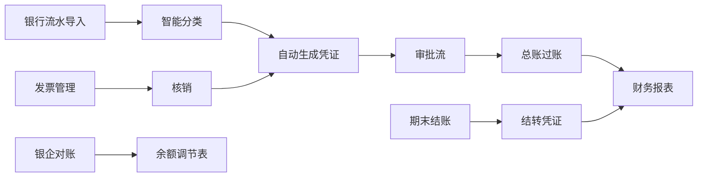

# 慧财智能财务平台 (Huihua Finance)

> 银行流水驱动的业财一体化 SaaS 平台 — Go + Vue 3 全栈实现

[](https://go.dev/)
[](https://vuejs.org/)
[](https://www.postgresql.org/)
[](LICENSE)

---

## 目录

- [项目概述](#项目概述)
- [技术栈](#技术栈)
- [核心业务流程](#核心业务流程)
- [功能模块](#功能模块)
- [项目结构](#项目结构)
- [快速开始](#快速开始)
- [开发指南](#开发指南)
- [API 概览](#api-概览)
- [测试](#测试)
- [部署](#部署)
- [相关文档](#相关文档)

---

## 项目概述

慧财智能财务平台是一套面向中小企业的**第二代财务系统技术验证**。以**银行流水为核心入口**，自动生成凭证、自动审批、智能对账，打通业财税全链路。

### 核心理念

- **流水驱动** — 银行流水进入系统即触发后续全部流程
- **业财一体** — 发票、收付款、凭证、报表全链路自动流转
- **多租户 SaaS** — 基于 PostgreSQL RLS 的原生多租户隔离
- **国产化适配** — 遵循中国会计准则与发票制度

### 目标用户

| 角色 | 职责 |
|------|------|
| 出纳 | 银行流水导入、银企对账 |
| 往来会计 | 发票管理、核销处理 |
| 财务主管 | 凭证审核、期末结账、报表 |
| 老板/经理 | 经营分析、财务报表查看 |
| 普通员工 | 费用报销 |
| 代账会计 | 多家企业账务处理 |

---

## 技术栈

### 后端

| 层次 | 技术 | 说明 |
|------|------|------|
| 语言 | **Go 1.24** | 高性能编译型语言 |
| HTTP 框架 | **Fiber v2** | 类 Express 的高速路由框架 |
| 数据库驱动 | **pgx v5** (pgxpool) | 原生 PostgreSQL 驱动，连接池管理 |
| 数据访问 | **原生 SQL** | 无 ORM，全部手写 SQL |
| 配置管理 | **Viper** | `.env` 文件 + 环境变量 |
| 缓存 | **Redis 7** (go-redis) | 会话/缓存层 |
| 认证 | **JWT (HS256)** | golang-jwt v5 |
| 金额处理 | **shopspring/decimal** | 精确十进制运算 |
| Excel 处理 | **xuri/excelize** | 发票/流水 Excel 导入 |
| 多租户 | **PostgreSQL RLS** | 行级安全策略隔离 |

### 前端

| 层次 | 技术 | 说明 |
|------|------|------|
| 框架 | **Vue 3.4** (Composition API) | `<script setup>` 响应式组件 |
| 构建工具 | **Vite 5** | 开发服务器 + 生产构建 |
| 语言 | **TypeScript 5.4** (strict) | 全栈类型安全 |
| UI 组件库 | **Element Plus 2.7** | 中后台组件体系 |
| 状态管理 | **Pinia 2** | Composition API 风格 Store |
| 路由 | **Vue Router 4** | 路由守卫 + 角色权限 |
| HTTP 客户端 | **Axios** | 拦截器注入 JWT + 统一错误处理 |
| 图表 | **ECharts 5** + vue-echarts | 财务报表可视化 |
| CSS 预处理器 | **SCSS** | 全局样式变量体系 |
| Mock 服务 | **MSW 2** | 开发模式 API Mock |
| 包管理 | **pnpm** | 依赖管理 |

### 基础设施

| 组件 | 版本 | 用途 |
|------|------|------|
| PostgreSQL | 15 | 主数据库 |
| Redis | 7-alpine | 缓存 |
| Docker Compose | — | 本地基础设施编排 |

---

## 核心业务流程



### 全链路数据流

1. **银行流水** → 导入 → 智能分类 → 自动生成凭证 → 提交审批 → 总账过账
2. **发票管理** → 收票/开票 → 核销匹配 → 关联凭证
3. **银企对账** → 5 级匹配策略 → 余额调节表
4. **期末处理** → 折旧计提 → 汇兑损益 → 期间结转 → 财务报表

---

## 功能模块

### F0 基础设施 ✅
- JWT 认证 + 角色权限
- PostgreSQL RLS 多租户隔离
- 审计日志
- 应用用户管理

### F1 账套初始化 ✅
- 公司注册与账套创建
- 科目表（嵌套集模型，支持树形结构）
- 客商档案管理
- 会计期间配置
- 开办余额导入
- 初始试算平衡

### F2 发票管理 ✅
- 发票 CRUD
- Excel 批量导入与解析
- 智能分类规则引擎
- 按多维度搜索过滤

### F3 银行流水 ✅
- CSV/Excel/Camt053/MT940 多格式导入
- 智能自动分类（规则引擎）
- 重复检测
- 手工标记匹配

### F4 凭证状态机 ✅
- 完整状态流转：草稿 → 提交 → 核准 / 驳回 → 取消 / 红冲
- 总账(GL)实时过账
- 凭证状态变更审计追踪
- 红字冲销

### F5 凭证自动生成 ✅
- 银行流水 → 凭证 智能转换
- 凭证模板驱动
- 批量生成
- 支持自动提交审批

### F6 固定资产 ✅
- 资产卡片管理
- 折旧计划自动生成
- 折旧执行与凭证生成

### F7 银行对账 ✅
- 5 级智能匹配策略
- 余额调节表
- 未达账项管理

### F8 财务报表 ✅
- 试算平衡表
- 利润表
- 资产负债表
- 期间总账合并

### F9 审批流 ✅
- 多级审批流程配置
- 金额阈值设置（DB 化）
- 模板与审批流绑定
- 审批任务管理

### F10 会计期间结账 ✅
- 期间开启/关闭
- 结账前健康检查
- 自动生成结转凭证

---

## 项目结构

```
huihua-finance/
├── cmd/api/main.go              # 应用入口（路由注册）
├── internal/
│   ├── config/                  # Viper 配置加载
│   ├── middleware/               # JWT 认证 + RLS 租户中间件
│   ├── model/                   # 22 个数据模型
│   ├── handler/                 # 21 个 HTTP Handler
│   ├── service/                 # 21 个业务逻辑 Service
│   └── repository/              # 18 个数据访问 Repository
├── pkg/
│   ├── database/                # pgxpool + Redis 客户端
│   ├── jwt/                     # JWT 签发与验证
│   └── utils/                   # 通用工具函数
├── migrations/                  # 23 个 SQL 迁移文件
├── tests/                       # Python 集成测试套件
├── frontend/                    # Vue 3 SPA
│   └── src/
│       ├── api/                 # Axios 封装 + 6 个业务模块
│       │   ├── modules/         # auth, account, bank, invoice, payment, voucher
│       │   └── mock/            # MSW Mock Service Worker
│       ├── components/          # 8 个公共/业务组件
│       ├── config/              # 应用 + 菜单配置
│       ├── stores/              # Pinia 状态管理 (auth, app, tenant)
│       ├── router/              # Vue Router + 守卫
│       ├── views/               # 22 个页面（11 个目录）
│       ├── types/               # 枚举 + 模型 + API 类型定义
│       └── styles/              # SCSS 全局样式
├── docker-compose.yml           # PostgreSQL + Redis 本地环境
├── Dockerfile                   # Go 多阶段构建
├── go.mod / go.sum              # Go 模块依赖
└── MEMORY.md                    # 项目架构知识库
```

---

## 快速开始

### 前置要求

- Go 1.22+
- Node.js 18+ & pnpm
- Docker & Docker Compose

### 1. 启动基础设施

```bash
docker compose up -d
# 启动 PostgreSQL (5432) + Redis (6380)
```

### 2. 数据库迁移

执行 `migrations/` 目录下的 SQL 文件，按编号顺序执行：

```bash
# 使用 psql 执行
for f in migrations/*.sql; do
  psql -h localhost -U huihua -d huihua_finance -f "$f"
done
```

### 3. 启动后端

```bash
# 复制环境变量
cp .env.example .env
# 编辑 .env 配置数据库连接信息

# 编译并启动
go build -o /tmp/huihua-api ./cmd/api
/tmp/huihua-api
# API 服务: http://localhost:8080
# 健康检查: http://localhost:8080/health
```

### 4. 启动前端

```bash
cd frontend
pnpm install

# 开发模式（Mock 开启）
pnpm dev
# 前端: http://localhost:3002

# 开发模式（连接真实后端）
VITE_ENABLE_MOCK=false pnpm dev
```

### 5. 登录系统

使用预设的测试用户登录（需先执行种子数据迁移）：

| 用户名 | 密码 | 角色 |
|--------|------|------|
| `testuser` | `test123` | admin |

---

## 开发指南

### 后端开发

**分层架构原则：**

```
Handler (HTTP) → Service (业务) → Repository (数据)
```

- **Handler** — 参数解析、响应格式化，不含业务逻辑
- **Service** — 业务编排、事务管理、权限校验
- **Repository** — 原生 SQL，参数绑定，结果扫描

**添加新 API 的步骤：**

1. `internal/repository/` — 新增数据访问方法
2. `internal/service/` — 新增业务逻辑方法
3. `internal/handler/` — 新增 HTTP Handler
4. `cmd/api/main.go` — 注册路由

**金额处理规范：**

```go
// 所有金额必须使用 shopspring/decimal
// 传输到前端时使用 .CoefficientInt64() 而非 .Int64()
amount := entry.Amount.CoefficientInt64()
```

### 前端开发

**目录约定：**

- `views/` — 页面级组件，一个 `.vue` 文件一个路由
- `components/` — 可复用组件
- `api/modules/` — API 调用封装，按业务模块拆分
- `stores/` — Pinia Store，Composition API 风格

**权限控制：**

```typescript
// 路由元信息声明
meta: { title: '科目表', roles: ['admin', 'agent'] }

// 模板中组件级别权限
<el-button v-permission="'voucher.create'">新增凭证</el-button>
```

### 前后端联调

- 前端开发服务器 `:3002` 通过 Vite proxy 将 `/api` 请求转发到 `:8080`
- 无需手动配置 CORS
- 可通过环境变量 `VITE_ENABLE_MOCK=true` 开启 MSW Mock

---

## API 概览

99 条 API 路由，全部接通。按模块分组：

| 路由前缀 | Handler | 说明 |
|---------|---------|------|
| `/health` | HealthHandler | 健康检查 |
| `/api/v1/auth` | AuthHandler | 登录认证 |
| `/api/v1/accounts` | AccountHandler | 科目管理 |
| `/api/v1/parties` | PartyHandler | 往来单位 |
| `/api/v1/bank-accounts` | BankAccountHandler | 银行账户 |
| `/api/v1/bank-transactions` | BankTxnHandler | 银行流水 |
| `/api/v1/vouchers` | VoucherHandler | 凭证管理 |
| `/api/v1/voucher-templates` | VoucherTemplateHandler | 凭证模板 |
| `/api/v1/auto-generate` | VoucherAutoGenerateHandler | 自动生成凭证 |
| `/api/v1/reconciliation` | ReconciliationHandler | 核销管理 |
| `/api/v1/bank-reconciliation` | BankReconciliationHandler | 银企对账 |
| `/api/v1/invoices` | InvoiceHandler | 发票管理 |
| `/api/v1/classification-rules` | ClassificationRuleHandler | 分类规则 |
| `/api/v1/approval-flows` | ApprovalFlowHandler | 审批流 |
| `/api/v1/approval-tasks` | ApprovalTaskHandler | 审批任务 |
| `/api/v1/reports` | ReportHandler | 财务报表 |
| `/api/v1/periods` | PeriodHandler | 会计期间 |
| `/api/v1/fixed-assets` | FixedAssetHandler | 固定资产 |
| `/api/v1/depreciation` | DepreciationHandler | 折旧处理 |
| `/api/v1/exchange-rates` | ExchangeRateHandler | 汇率管理 |
| `/api/v1/audit-logs` | AuditHandler | 审计日志 |

### 认证方式

所有受保护 API 使用 **Bearer Token**：

```
Authorization: Bearer <JWT Token>
```

---

## 测试

### 后端集成测试（Python）

```bash
# 确保后端正在运行
cd tests
python3 test_api.py
```

807 行 Python 集成测试覆盖核心 API 端点。

### 前端测试

```bash
cd frontend
pnpm test:unit     # Vitest 单元测试
pnpm test:e2e      # Playwright E2E 测试
```

---

## 部署

### Docker 构建

```bash
# 多阶段构建
docker build -t huihua-finance-api .

# 运行
docker run -d \
  -p 8080:8080 \
  --env-file .env \
  huihua-finance-api
```

### 生产架构

```
Nginx (反向代理 + 静态文件)
├── /api/* → Go API (:8080)
└── /* → Vue SPA (dist/)
```

---

## 项目状态

| 维度 | 状态 | 说明 |
|------|------|------|
| 后端 API | ✅ **99 条路由全部接通** | F0-F10 全部完成 |
| 前端页面 | ✅ **22 个页面可用** | 核心功能全覆盖 |
| 数据库 | ✅ **23 个迁移文件** | 包含种子数据 |
| 集成测试 | ✅ **807 行 Python 测试** | 覆盖核心 API |
| 完成度 | **~83%** | 剩余低优功能待完善 |

### 剩余工作 (~17%)

- 经营分析仪表盘页面
- 费用报销模块
- 凭证模板克隆功能
- 银行交易 Update 接口
- 银行对账自动匹配入口
- E2E 测试套件完善

---

## 相关文档

- [MEMORY.md](./MEMORY.md) — 项目架构知识库与关键实现细节
- [docs/plans/](./docs/plans/) — 任务计划文档
- [frontend/README.md](./frontend/README.md) — 前端开发说明

---

## 架构决策记录

| 决策 | 选择 | 理由 |
|------|------|------|
| ORM 选型 | 无 ORM，原生 SQL | 财务系统对 SQL 精确度要求极高 |
| 多租户方案 | PostgreSQL RLS | 原生支持，维护成本最低 |
| 金额类型 | `shopspring/decimal` | 避免浮点数精度问题 |
| HTTP 框架 | Fiber v2 | 高性能，类 Express API |
| 前端 Mock | MSW | 真实拦截 Service Worker，贴近生产 |
| 科目表模型 | 嵌套集 (lft/rgt) | 高效树形查询，无需递归 CTE |

---

*慧财智能财务平台 — 中小企业财务数字化的技术验证项目*
