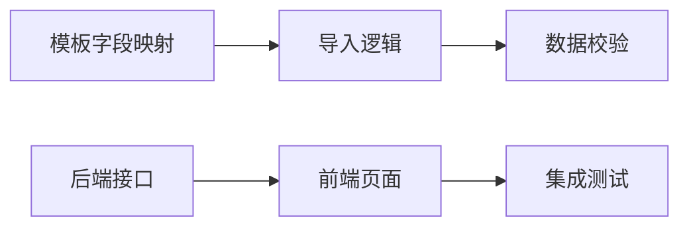

# 销售发票管理模块开发计划

## 文档信息

| 属性 | 内容 |
|------|------|
| **文档版本** | V1.0 |
| **创建日期** | 2026-06-03 |
| **适用范围** | 慧财智能财务平台 - 发票收支管理模块 |
| **优先级** | P0 - 核心功能 |

---

## 一、需求分析

### 1.1 模板结构分析
基于 `/root/data/disk/huihua-finance/销售发票（2025年）.xlsx` 模板分析

**核心字段分类：**

| 字段类别 | 关键字段 |
|---------|---------|
| **发票标识** | 发票代码、发票号码、数电发票号码 |
| **购销双方** | 销方识别号、销方名称、购方识别号、购买方名称 |
| **开票信息** | 开票日期、发票状态、是否正数发票、开票人 |
| **商品明细** | 货物或应税劳务名称、规格型号、单位、数量、单价、金额 |
| **税额信息** | 税率、税额、价税合计 |
| **风险等级** | 发票风险等级 |

### 1.2 核心需求点（基于需求规格说明书V2.0）

| 需求 | 描述 |
|------|------|
| 批量导入 | 支持电子税务局标准模板导入 |
| AI智能查重 | 导入时与系统内发票比对，标记重复 |
| 发票确认 | 确认后生成应收账款记录 |
| 状态流转 | 草稿 → 已确认 → 部分核销 → 已核销 → 已归档 |

---

## 二、开发计划

### 阶段一：需求与设计（第1天）

| 任务ID | 任务描述 | 负责人 | 预估时间 | 交付物 |
|--------|---------|--------|---------|--------|
| D001 | 分析模板字段与系统字段映射关系 | 开发 | 0.5天 | 字段映射文档 |
| D002 | 设计导入流程与交互原型 | 开发 | 0.5天 | 交互流程图 |

### 阶段二：后端开发（第2-4天）

| 任务ID | 任务描述 | 负责人 | 预估时间 | 交付物 |
|--------|---------|--------|---------|--------|
| B001 | 销售发票专用导入接口开发 | 后端 | 1天 | `/api/invoice/sales/import` |
| B002 | 导入预览与校验接口 | 后端 | 0.5天 | `/api/invoice/sales/import/{batch_id}/preview` |
| B003 | 确认导入接口 | 后端 | 0.5天 | `/api/invoice/sales/import/{batch_id}/confirm` |
| B004 | 发票确认接口（生成应收） | 后端 | 0.5天 | `/api/invoice/sales/confirm` |
| B005 | AI查重逻辑实现 | 后端 | 0.5天 | 重复发票检测 |
| B006 | 状态流转逻辑 | 后端 | 0.5天 | 状态机实现 |

### 阶段三：前端开发（第5-7天）

| 任务ID | 任务描述 | 负责人 | 预估时间 | 交付物 |
|--------|---------|--------|---------|--------|
| F001 | 销售发票Tab页开发 | 前端 | 1天 | 发票工作台 |
| F002 | 批量导入向导组件 | 前端 | 1.5天 | 文件上传、字段映射、预览 |
| F003 | AI查重标记展示 | 前端 | 0.5天 | 重复警告、悬浮提示 |
| F004 | 全屏可编辑表格 | 前端 | 1天 | 数据修正、校验状态列 |
| F005 | 发票确认弹窗 | 前端 | 0.5天 | 二次确认、生成应收提示 |
| F006 | 状态标签样式 | 前端 | 0.5天 | 彩色状态标签 |

### 阶段四：测试与集成（第8-9天）

| 任务ID | 任务描述 | 负责人 | 预估时间 | 交付物 |
|--------|---------|--------|---------|--------|
| T001 | 接口单元测试 | 测试 | 1天 | 测试用例 |
| T002 | 导入流程集成测试 | 测试 | 1天 | 集成测试报告 |
| T003 | Bug修复与优化 | 开发 | 1天 | 修复记录 |

### 阶段五：文档与交付（第10天）

| 任务ID | 任务描述 | 负责人 | 预估时间 | 交付物 |
|--------|---------|--------|---------|--------|
| D003 | 接口文档更新 | 开发 | 0.5天 | API文档 |
| D004 | 用户操作手册 | 开发 | 0.5天 | 操作指南 |

---

## 三、接口开发清单

| 接口路径 | HTTP方法 | 功能描述 | 优先级 |
|---------|----------|---------|--------|
| `/api/invoice/sales/import` | POST | 上传文件，创建导入批次 | **P0** |
| `/api/invoice/sales/import/{batch_id}/preview` | GET | 获取预览数据与校验结果 | **P0** |
| `/api/invoice/sales/import/{batch_id}/confirm` | POST | 确认导入选中数据 | **P0** |
| `/api/invoice/sales/confirm` | POST | 确认发票，生成应收账款 | **P0** |
| `/api/invoice/sales` | GET | 查询销售发票列表 | P1 |
| `/api/invoice/sales` | POST | 手工录入销售发票 | P1 |
| `/api/invoice/sales/{id}` | GET | 获取发票详情 | P1 |
| `/api/invoice/sales/{id}` | PUT | 更新发票信息 | P1 |
| `/api/invoice/sales/{id}` | DELETE | 删除发票 | P2 |

---

## 四、字段映射设计

| 模板字段 | 系统字段 | 必填 | 映射规则 |
|---------|---------|------|---------|
| 数电发票号码 / 发票号码 | invoice_no | **是** | 优先取数电发票号码 |
| 开票日期 | posting_date | **是** | 日期格式化转换 |
| 购买方名称 | customer_name | **是** | 直接映射 |
| 购方识别号 | customer_tax_id | 否 | 直接映射 |
| 价税合计 | total_amount | **是** | 数值转换 |
| 金额（不含税） | net_amount | 否 | 数值转换 |
| 税额 | tax_amount | 否 | 数值转换 |
| 税率 | tax_rate | 否 | 百分比转换（如"13%" → 0.13） |
| 发票状态 | status | 否 | 映射为系统状态 |
| 发票票种 | invoice_type | 否 | 销项/进项判断 |

---

## 五、状态流转设计

```
批量导入/手工录入 → 草稿 → 已确认 → 部分核销 → 已核销 → 已归档
                        ↓
                   （确认后生成应收账款）
```

| 状态码 | 状态名称 | 说明 | 可执行操作 |
|--------|---------|------|-----------|
| `draft` | 草稿 | 待确认状态 | 编辑、确认、删除 |
| `confirmed` | 已确认 | 已生成应收账款 | 查看核销记录 |
| `partial_reconciled` | 部分核销 | 部分金额已核销 | 继续核销 |
| `reconciled` | 已核销 | 完全核销 | 归档 |
| `archived` | 已归档 | 业务完结 | 查看，不可编辑 |

---

## 六、风险评估

| 风险ID | 风险描述 | 影响程度 | 缓解措施 |
|--------|---------|---------|---------|
| R001 | 税务局导出格式变更 | 高 | 支持自定义模板映射配置 |
| R002 | 单次导入数据量过大 | 中 | 异步处理，分批入库 |
| R003 | 重复发票检测误判 | 中 | 多重条件比对（发票号+金额+日期） |
| R004 | 并发导入数据冲突 | 低 | 批次ID隔离，事务保护 |

---

## 七、里程碑

| 日期 | 里程碑 | 交付内容 |
|------|--------|---------|
| 第1天 | 设计完成 | 字段映射文档、交互设计 |
| 第4天 | 后端完成 | 所有接口开发与测试 |
| 第7天 | 前端完成 | 所有页面与组件开发 |
| 第9天 | 测试完成 | 集成测试通过 |
| 第10天 | 正式交付 | 功能上线，文档更新 |

---

## 八、依赖关系



---

## 九、备注

> **优先级说明**：销售发票批量导入作为核心需求，优先于采购发票和费用发票功能开发。
>
> **版本控制**：本计划将根据实际开发进度进行迭代更新。

---

**文档修订记录**

| 版本 | 日期 | 修改内容 | 修改人 |
|------|------|---------|--------|
| V1.0 | 2026-06-03 | 初始版本 | AI Assistant |