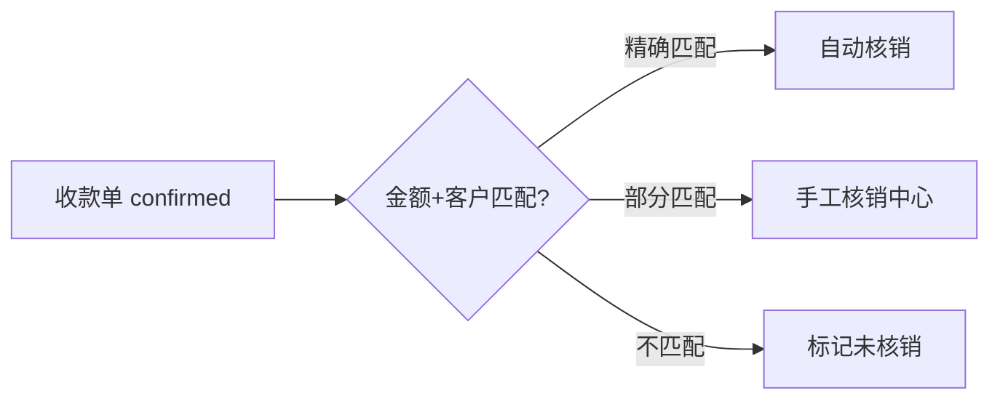

# 银行流水驱动业财一体化 — 全链路改进计划

> 日期: 2026-05-30 | 优先级: P0 | 基于: 业财一体化需求分析 V2.0 + 代码审计结果

---

## 一、现状 vs 目标流程

### 当前实现

```
ImportView (静态演示)
  ↓
智能分类 (规则引擎匹配科目)
  ↓
VoucherAutoGenerateService (直接生成2行分录凭证)
  ↓
银企对账 (5级匹配)
```

### 需求分析目标流程

```
银行流水导入 → 智能分类(6类) → 生成业务单据(6种)
    → 单据确认/审核 → 发票核销(收/付款单) → 登记日记账
    → 凭证模板匹配 → 生成凭证 → 凭证审核
```

### 差距概览

| # | 环节 | 当前状态 | 目标状态 | 优先级 |
|---|------|---------|---------|:------:|
| 1 | 导入前端 | 静态演示数据 | 真实 API 联调 | 🔴 P0 |
| 2 | 待处理流水池 | 不存在 | 未分类流水中转、人工处理 | 🔴 P0 |
| 3 | 业务单据层 | 不存在 | 6 种单据（收/付/费用/利息/转账/现金） | 🔴 P0 |
| 4 | 发票核销联动 | 不存在 | 收/付款单自动匹配发票、核销 | 🔴 P0 |
| 5 | 日记账自动登记 | 不存在 | 单据确认后自动登记银行/现金日记账 | 🔴 P0 |
| 6 | 凭证模板匹配 | 科目写死 | 按单据类型+模板生成多行分录 | 🟡 P1 |
| 7 | 出纳核对工作台 | 部分静态 | 全量真实数据+6 分类标签+批量操作 | 🟡 P1 |
| 8 | 双向联查 | 不存在 | 凭证↔流水双向追溯 | 🟡 P1 |
| 9 | 银企直连 | 模拟按钮 | 真实 API 接入 | 🟢 P2 |
| 10 | 多格式导入增强 | CSV/Excel | + CAMT053 / MT940 原生解析 | 🟢 P2 |

---

## 二、分阶段改进计划

### Phase 1 — 打通业务单据层（🔴 P0，估算 5-7 天）

目标：在"智能分类"和"生成凭证"之间插入完整的业务单据管理层。

#### 1.1 业务单据数据模型（1 天）

在 `internal/model/` 新增统一单据模型 `BusinessDocument`：

```go
type BusinessDocument struct {
    ID              uuid.UUID       `json:"id" db:"id"`
    TenantID        uuid.UUID       `json:"tenant_id" db:"tenant_id"`
    DocType         string          `json:"doc_type"`          // receipt / payment / bank_fee / interest / transfer / cash
    DocNo           string          `json:"doc_no"`            // 自动编号 RD-202605-001
    BankTxnID       *uuid.UUID      `json:"bank_txn_id"`       // 来源银行流水
    Status          string          `json:"status"`            // draft / confirmed / voided
    Amount          decimal.Decimal `json:"amount"`
    CounterpartyName string         `json:"counterparty_name"`
    Description     string          `json:"description"`
    ConfirmedBy     *uuid.UUID      `json:"confirmed_by"`
    ConfirmedAt     *time.Time      `json:"confirmed_at"`
    VoucherID       *uuid.UUID      `json:"voucher_id"`        // 关联凭证
    CreatedAt       time.Time       `json:"created_at"`
    UpdatedAt       time.Time       `json:"updated_at"`
}
```

新建 `business_document_repo.go` + `business_document_service.go`

#### 1.2 智能分类引擎增强（1 天）

当前：分类只匹配科目 → 改为分类为 6 种单据类型。

在 `classification_rule.go` 增加 `doc_type` 字段，规则匹配时返回：
```json
{ "doc_type": "receipt", "account_id": "xxx", "confidence": 0.95 }
```

分类逻辑细化：

| 规则特征 | → 单据类型 |
|---------|-----------|
| 摘要含"收款/回款/货款"且贷方 | receipt |
| 摘要含"付款/支付/货款"且借方 | payment |
| 摘要含"手续费/账户管理费/短信费" | bank_fee |
| 摘要含"利息/结息"且贷方 | interest |
| 同银行账户间（对方名匹配本行） | transfer |
| 其他 | pending（待处理） |

#### 1.3 导入流程重构（1 天）

ImportView.vue → 对接真实 API：

```
上传 → 解析 → 预览 → 确认导入
  → 后端 ImportFromExcel 增强：
    1. 解析 + 查重（fingerprint hash）
    2. 自动分类（doc_type）
    3. 自动生成 BusinessDocument（status=draft）
    4. 返回导入结果（含分类统计）
```

**后端改动**：`bank_transaction_service.go` ImportFromExcel 后串联分类 + 单据创建

#### 1.4 待处理流水池（1 天）

新增 `PendingPoolView.vue`：
- 展示所有 `doc_type=pending` 的业务单据
- 每行提供"归类为"下拉操作（收/付/费用/利息/转账）
- 批量处理 + 补充字段（对方户名、备注）
- 确认后生成正式 BusinessDocument

**后端**：`BusinessDocumentService.ConfirmDocType(id, doc_type)`

#### 1.5 出纳核对工作台完善（1 天）

CashierWorkbench.vue 增强：
- 对接真实 `GET /bank-transactions?status=xxx` API
- 按 6 类标签筛选（当前已有 UI 但需真实数据）
- 批量确认/驳回
- 统计数字对接真实计数 API

#### 1.6 单据确认流程（1-2 天）

BusinessDocument 状态流转：
```
draft → confirmed (出纳确认) → 自动登记日记账 → 可供核销/生成凭证
  ↑        ↓
  └── rejected (驳回，退回待处理池)
```

**确认时自动执行**：
1. 登记银行日记账（`BankTransaction.MarkAsMatched`）
2. 收/付款单 → 触发发票匹配（调用核销引擎）
3. 非核销类（费用/利息/转账）→ 标记为可生成凭证

---

### Phase 2 — 核销联动与日记账（🔴 P0，估算 3-4 天）

#### 2.1 收款单自动匹配发票（2 天）

需求：收款单 confirmed 后，按客户名称+金额匹配未核销销售发票。



**后端**：新建 `WriteOffService.AutoMatchReceipt(receiptDocID)`，在 BusinessDocumentService.Confirm 中串联调用。

#### 2.2 付款单自动匹配发票（1 天）

同上逻辑，按供应商名称匹配采购发票。

#### 2.3 余额调节表增强（0.5 天）

当前 BalanceSheet.vue 已存在，需验证真实 API 对接。

#### 2.4 银行日记账自动登记（0.5 天）

在 BusinessDocument confirmed 时：
- `bank_transactions` 表标记 `is_matched=true`
- 登记 `bank_reconciliation` 日记账条目

---

### Phase 3 — 凭证模板匹配（🟡 P1，估算 3-4 天）

#### 3.1 凭证模板绑定单据类型（1 天）

当前 `voucher_templates` 表已有 CRUD + 编号规则。增加字段：
```sql
ALTER TABLE voucher_templates ADD COLUMN doc_type varchar(50);
ALTER TABLE voucher_templates ADD COLUMN debit_account_id uuid;
ALTER TABLE voucher_templates ADD COLUMN credit_account_id uuid;
```

这样每种单据类型可以绑定预设借/贷科目。

#### 3.2 GenerateVoucher 使用模板（1 天）

改造 `voucher_auto_generate_service.go`：

```go
func (s *VoucherAutoGenerateService) GenerateFromDocument(ctx, tenantID, docID) {
    doc := getBusinessDocument(docID)
    template := getTemplateByDocType(doc.DocType)
    // 使用模板的 debit/credit account 生成分录
    // 支持多行分录（如银行费用+增值税）
}
```

#### 3.3 批量生成凭证（1 天）

当前已有 `BatchGenerate` 端点，改造为基于 BusinessDocument 列表：
```
POST /api/v1/business-documents/batch-generate
→ 选中多个 confirmed 单据 → 逐个按模板生成凭证
```

#### 3.4 凭证模板前端页面（0.5 天）

`VoucherTemplateList.vue` — 后端 CRUD 完整，前端缺失。

---

### Phase 4 — 双向联查与追溯（🟡 P1，估算 2 天）

#### 4.1 凭证←→流水联查（1 天）

- BusinessDocument 表存 `voucher_id`
- BankTransaction 表存 `matched_journal_entry_id`
- 后端新增 `GET /api/v1/links/voucher/{id}/source` 返回来源单据/流水
- 后端新增 `GET /api/v1/links/bank-transaction/{id}/voucher` 返回关联凭证
- 前端 VoucherDetail 增加"来源"面板，显示原始银行流水/发票信息

#### 4.2 审计日志增强（0.5 天）

确认/生成凭证/核销等关键操作记录完整审计轨迹。

#### 4.3 操作日志前端（0.5 天）

当前审计日志 API 完整，前端页面缺失。

---

### Phase 5 — 优化与工具（🟢 P2，估算 2-3 天）

#### 5.1 银企直连入口（1 天）
- 对接银企直连 API（银企云/用友等）
- ImportView 的 "📡 银企直连抓取" 按钮对接真实后端

#### 5.2 自动对账增强（1 天）
- 当前 5 级匹配后端完整，但前端无独立自动匹配入口按钮
- 新增 BatchAutoMatch 按钮 + 进度反馈

#### 5.3 重复流水校验增强（0.5 天）
- 当前：简单查重
- 增强：fingerprint hash（摘要+金额+日期+对方）防重复

#### 5.4 导入格式增强（0.5 天）
- 当前：CSV/Excel
- 增强：CAMT053 XML 原生解析（欧洲银行标准）
- 增强：MT940 文本解析

---

## 三、按文件维度的实施顺序

### 后端新增文件

```
internal/model/business_document.go          — Phase 1.1
internal/repository/business_document_repo.go — Phase 1.1
internal/service/business_document_service.go — Phase 1.1
internal/service/write_off_service.go         — Phase 2.1
internal/handler/business_document_handler.go — Phase 1.1
internal/handler/write_off_handler.go         — Phase 2.1
```

### 后端修改文件

```
internal/service/bank_transaction_service.go       — import 后串联分类+单据 (1.3)
internal/service/classification_rule_service.go    — 增加 doc_type 匹配 (1.2)
internal/service/voucher_auto_generate_service.go — 改用模板生成 (3.2)
internal/repository/bank_transaction_repo.go       — 增加 fingerprint 查重 (5.3)
cmd/api/main.go                                    — 注册新路由
```

### 前端新增文件

```
frontend/src/views/bank/PendingPoolView.vue         — Phase 1.4
frontend/src/views/bank/BusinessDocumentList.vue     — Phase 1.1
frontend/src/api/modules/business_document.ts        — Phase 1.1
frontend/src/api/modules/write_off.ts                — Phase 2.1
```

### 前端修改文件

```
frontend/src/views/bank/ImportView.vue          — 真实 API 对接 (1.3)
frontend/src/views/bank/CashierWorkbench.vue    — 真实数据 + 批量操作 (1.5)
frontend/src/views/voucher/VoucherList.vue      — 联查按钮 (4.1)
frontend/src/api/modules/voucher.ts             — 联查 API (4.1)
```

---

## 四、共性问题修补（贯穿所有 Phase）

| 问题 | 影响 | 修复 |
|------|------|------|
| ImportView 静态演示 | 用户无法真实导入 | Phase 1.3 |
| CashierWorkbench 部分静态 | 出纳无法核对真实数据 | Phase 1.5 |
| VoucherList 静态数据 | 会计看不到真实凭证 | 独立 P0（已识别） |
| FinancialReports export 空壳 | 用户无法下载报表 | Phase 3+ 独立 |
| PreCloseCheck 仅 6/30 项 | 结账检查不可靠 | 独立 P0（已识别） |

---

## 五、验收标准

Phase 1 完成时：
- [ ] 流水导入 → 自动分类为 6 种单据类型
- [ ] 待处理流水池可手工归类
- [ ] 出纳核对工作台展示真实数据并提供确认/驳回操作
- [ ] 单据确认后登记日记账

Phase 2 完成时：
- [ ] 收款单自动匹配未核销销售发票
- [ ] 付款单自动匹配未核销采购发票
- [ ] 手工核销中心支持金额拆分和容差处理

Phase 3 完成时：
- [ ] 凭证模板绑定单据类型
- [ ] 一键从单据生成凭证（使用模板科目）
- [ ] 批量生成凭证

Phase 4 完成时：
- [ ] 凭证详情可追溯至原始银行流水
- [ ] 银行流水可查看已生成的凭证

---

## 六、风险与依赖

| 风险 | 影响 | 缓解措施 |
|------|------|---------|
| 业务单据表 schema 变更需迁移 | 现有数据不兼容 | 新增表，不影响现有数据 |
| 发票核销引擎复杂 | Phase 2 可能延期 | 先做精确匹配，容差和后做 |
| 前端 ImportView 重构耦合 UI 交互 | 用户视觉变化大 | 保留现有 UI 布局，只替换数据源 |
| 多格式解析（CAMT053/MT940） | 格式文档需获取 | Phase 5 低优先级，不阻塞主流程 |
