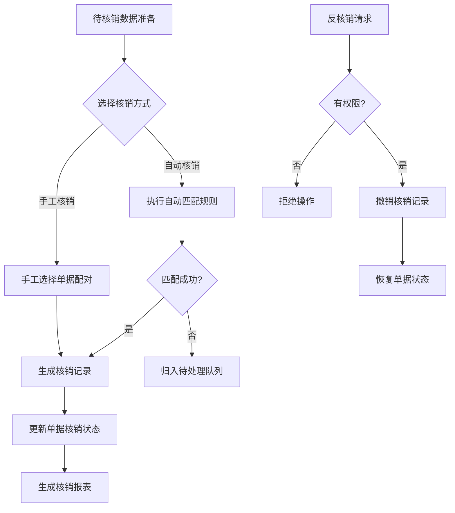

# 核销模块功能设计文档

## 1. 模块定位

核销模块是连接资金流水（收/付款单）与债权债务（应收/应付单）的核心枢纽，负责建立收付款与应收应付之间的关联关系，实现资金流与债权债务的匹配结清。

**输入**：已生成的收款单/付款单、应收单/应付单  
**输出**：核销记录、单据核销状态更新、未核销清单、核销报表

---

## 2. 业务流程



---

## 3. 功能需求

### 3.1 待核销数据准备

| 单据类型 | 参与核销条件 |
|---------|------------|
| 收款单 | 状态为"未核销"或"部分核销" |
| 付款单 | 状态为"未核销"或"部分核销" |
| 应收单 | 状态为"未核销"或"部分核销"且未逾期关闭 |
| 应付单 | 状态为"未核销"或"部分核销"且未逾期关闭 |

**筛选条件**：
- 按客户/供应商筛选
- 按金额范围筛选
- 按日期范围筛选

### 3.2 自动核销规则

#### 3.2.1 核销方向

| 核销类型 | 对应单据 |
|---------|---------|
| 收款核销 | 收款单 ↔ 应收单 |
| 付款核销 | 付款单 ↔ 应付单 |

#### 3.2.2 匹配条件优先级

| 优先级 | 匹配维度 | 具体规则 |
|-------|---------|---------|
| 1（最高） | 往来单位 | 收款单的付款方 = 应收单的客户；付款单的收款方 = 应付单的供应商 |
| 2 | 金额相等 | 单据金额完全相等（允许绝对或相对容差） |
| 3 | 单据编号/备注关联 | 收款单摘要/备注包含应收单号，或反之 |
| 4（最低） | 日期接近 | 收/付款单日期与应收/应付单日期之差 ≤ 设定天数（默认30天） |

#### 3.2.3 容差处理

- **容差类型**：
  - 绝对值容差（如 ±0.5 元）
  - 相对比例容差（如 ±0.1%）
- **处理方式**：
  - 金额在容差范围内时，自动按实际金额核销
  - 小额差异可计入"核销差异"科目或直接忽略

#### 3.2.4 多笔匹配逻辑

- **一对多**：一笔收款单金额大于单张应收单金额时，依次匹配多张应收单，直至收款金额用完，尾差生成预收
- **多对一**：多笔收款单共同核销同一笔应收单，支持按比例或手工指定顺序
- **部分核销**：允许一张单据多次核销，记录剩余未核销金额

### 3.3 手工核销

- **界面设计**：左右两侧分别展示未核销的收/付款单列表和应收/应付单列表
- **操作方式**：
  - 手动勾选一对多、多对一、多对多组合
  - 输入本次核销金额
  - 实时显示剩余未核销额
- **结果**：生成核销记录，更新单据状态

### 3.4 核销记录与反核销

#### 3.4.1 核销记录

| 字段 | 类型 | 说明 |
|-----|------|------|
| 核销单号 | varchar | 唯一标识 |
| 核销类型 | enum | 收款核应收 / 付款核应付 |
| 双方单据号 | varchar | 关联的收/付款单号和应收/应付单号 |
| 核销金额 | decimal | 本次核销金额 |
| 核销日期 | date | 核销操作日期 |
| 操作人 | varchar | 操作人姓名/ID |
| 状态 | tinyint | 1-正常，0-已反核销 |

#### 3.4.2 反核销

- **权限控制**：需有权限才能执行反核销
- **操作流程**：
  1. 在核销记录列表中选择"反核销"
  2. 二次确认后执行
  3. 恢复双方单据的未核销金额及状态
  4. 记录操作日志

### 3.5 异常与提醒

| 异常类型 | 触发条件 | 处理方式 |
|---------|---------|---------|
| 无法匹配 | 自动核销后仍未匹配的单据 | 自动归入"待处理队列"，页面高亮提醒 |
| 金额冲突 | 收款单金额远大于所有未核销应收单总额 | 提示"超出金额将转为预收" |
| 跨期太长 | 收/付款单与应收/应付单日期相差超过设定阈值（如180天） | 自动核销需经二次确认 |

### 3.6 批处理与调度

- **手动触发**：点击"开始核销"按钮触发自动核销
- **定时调度**：支持定时自动核销（如每日凌晨2点）
- **批量导入**：支持通过Excel模板导入核销方案（收款单号→应收单号→核销金额）

---

## 4. 界面与交互

### 4.1 待核销看板

- 展示未核销总金额（按客户/供应商分组）
- 展示逾期未核销金额
- 展示待处理异常数量

### 4.2 自动核销规则配置

- 勾选启用哪些匹配条件
- 设置优先级顺序
- 填写容差金额/比例
- 设置日期接近天数

### 4.3 自动核销执行界面

- 显示匹配过程日志
- 展示匹配结果预览
- 确认后批量执行

### 4.4 手工核销工作台

- 左右双列表布局
- 支持快速筛选、勾选
- 填写核销金额
- 实时显示剩余未核销额

### 4.5 核销历史查询

- 按时间段、往来单位、单据号查询
- 支持导出Excel

### 4.6 反核销操作

- 在核销记录列表中提供"反核销"按钮
- 二次确认后执行

---

## 5. 数据模型

### 5.1 核销记录表 (write_off_record)

| 字段名 | 类型 | 说明 |
|-------|------|------|
| id | bigint | 主键 |
| write_off_no | varchar | 核销单号，唯一 |
| type | enum | 收款核应收 / 付款核应付 |
| receipt_payment_id | bigint | 收款单或付款单的ID |
| receivable_payable_id | bigint | 应收单或应付单的ID |
| amount | decimal | 本次核销金额 |
| write_off_date | date | 核销日期 |
| operator | varchar | 操作人 |
| status | tinyint | 1-正常，0-已反核销 |
| created_at | datetime | 创建时间 |
| updated_at | datetime | 更新时间 |

### 5.2 单据余额字段扩展

在现有的收/付款单、应收/应付单表中增加以下字段：

| 字段名 | 类型 | 说明 |
|-------|------|------|
| total_amount | decimal | 原单总金额 |
| write_off_amount | decimal | 已核销金额 |
| remaining_amount | decimal | 未核销金额 |
| write_off_status | enum | 未核销 / 部分核销 / 已核销 |

---

## 6. 非功能性需求

| 需求类型 | 指标 |
|---------|------|
| 性能 | 自动核销1万张单据匹配耗时 ≤ 3秒 |
| 准确性 | 按配置规则匹配，不应遗漏可匹配项；同一组单据不应重复核销 |
| 可追溯 | 所有核销、反核销操作有日志，可追溯到人和时间 |
| 并发控制 | 多用户同时核销同一单据时，采用乐观锁或悲观锁，避免重复核销 |

---

## 7. 接口设计

### 7.1 触发自动核销

- **方法**：POST
- **路径**：`/api/writeoff/auto`
- **参数**：
  - `document_type` (可选)：单据类型
  - `start_date` (可选)：开始日期
  - `end_date` (可选)：结束日期
- **返回**：核销结果摘要

### 7.2 手工核销

- **方法**：POST
- **路径**：`/api/writeoff/manual`
- **Body**：
```json
{
  "receipt_payment_id": "string",
  "receivable_payable_id": "string",
  "amount": "decimal"
}
```

### 7.3 反核销

- **方法**：POST
- **路径**：`/api/writeoff/reverse/{record_id}`
- **返回**：操作结果

### 7.4 查询未核销金额汇总

- **方法**：GET
- **路径**：`/api/writeoff/unmatched-summary`
- **参数**：
  - `counterparty_id` (可选)：往来单位ID
- **返回**：按往来单位分组的未核销金额汇总

---

## 8. 验收标准

| 序号 | 验收项 | 验证方式 |
|-----|-------|---------|
| 1 | 自动核销能正确匹配"单位相同+金额相等"的单据 | 测试用例验证 |
| 2 | 配置容差后，金额相差在容差内的单据可自动核销 | 测试用例验证 |
| 3 | 手工核销界面可自由组合单据并指定核销金额 | 功能测试 |
| 4 | 反核销后单据金额恢复，可重新核销 | 测试用例验证 |
| 5 | 支持一对多、多对一、部分核销场景 | 测试用例验证 |
| 6 | 核销历史可导出，日志可查 | 功能测试 |
| 7 | 自动核销1万张单据耗时 ≤ 3秒 | 性能测试 |
| 8 | 多用户同时核销同一单据无冲突 | 并发测试 |